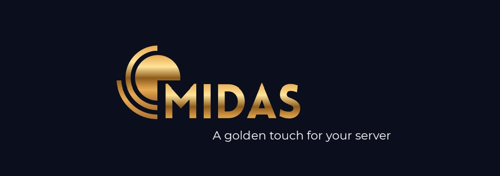

<div align="center">

<!-- Banner -->


# 🏦 Midas

Bot avançado de economia e progressão para Discord, focado em escalabilidade, automação, economias dinâmicas e personalização de servidores.

[]()
[]()
[]()
[]()
[]()

</div>

---

# 📖 Documentação

> [!IMPORTANT]
> LEIA

## 🇧🇷 Português (Versão Oficial)

- [Help](./docs/help.md)
- [Termos de Uso](./docs/ToS.md)
- [Política de Privacidade](./docs/Privacy-Policy.md)

## 🇺🇸 English (Translated Version)

- [Help](./docs/translations/en-US/help.md)
- [Terms of Service](./docs/translations/en-US/ToS.md)
- [Privacy Policy](./docs/translations/en-US/Privacy-Policy.md)
- [Read Me](./docs/translations/en-US/README.md)

> [!IMPORTANT]
> A versão em português prevalece em caso de conflito entre traduções.

---

# ✨ Recursos

- 📈 Sistema avançado de níveis e progressão
- 💰 Economia dinâmica multi-moeda
- 🏦 Moedas customizáveis por servidor
- 📊 Sistema automático de inflação
- 🎯 Missões e objetivos sazonais
- 🛒 Loja diária rotativa
- 🎨 Sistema de personalização de perfil
- 🌍 Suporte multilinguagem
---

# 🏗️ Arquitetura

```txt
src/
├── bot/              # Client, handlers e runtime
├── commands/         # Slash commands organizados por categoria
├── events/           # Eventos do Discord
├── modules/          # Lógica de negócio
├── db/               # Schema, client e Redis
├── jobs/             # Automações e cron jobs
├── i18n/             # Sistema de traduções
├── shared/           # Tipos, constantes e utilitários
├── data/             # Conteúdo dinâmico baseado em JSON
└── security/         # Sistemas de segurança e auditoria
```

---

# 🚀 Instalação

## 1. Instalar dependências

```
npm install
```
---

## 2. Configurar variáveis de ambiente

```
cp .env.example .env
```

Configure suas credenciais no ".env".

---

## 3. Gerar e migrar banco de dados

```
npm run db:generate
npm run db:migrate
```

---


## 4. 🐳 Docker Compose (Recomendado para Produção)

```yaml

services:
  postgres:
    image: postgres:16
    container_name: postgres
    restart: unless-stopped
    env_file:
      - .env
    ports:
      - "${POSTGRES_PORT}:5432"
    volumes:
      - postgres_data:/var/lib/postgresql/data

  redis:
    image: redis:7
    container_name: redis
    restart: unless-stopped
    ports:
      - "${REDIS_PORT}:6379"
    command: ["redis-server", "--requirepass", "${REDIS_PASSWORD}"]

volumes:
  postgres_data:

```

## 5. Inicializar aplicação

### 5.1 Desenvolvimento

```
npm run dev
```

### 5.2 Produção
```

npx tsx src/index.ts
```
---
# Sistemas

## 🏦 Sistema de Economia

O Midas possui um sistema de economia dinâmico com:

- Moeda global e moedas por servidor
- Rastreamento de inflação
- Taxas de câmbio
- Balanceamento automático
- Personalização de moedas
- Multiplicadores premium

> [!TIP]
> A inflação é calculada automaticamente com base no supply total e atividade do servidor.

---

## 🎯 Sistema de Missões

As missões são totalmente dinâmicas e carregadas sem necessidade de reinicialização.

Tipos suportados:

- Missões diárias
- Missões sazonais
- Objetivos de progressão
- Atividades econômicas

---

# 🔒 Segurança

O Midas foi projetado com arquitetura orientada à segurança.

Inclui:

- Logs operacionais
- Auditoria de comandos

> [!NOTE]
> Os canais oficiais de suporte e políticas de segurança estão documentados nos Termos de Uso e Política de Privacidade.

---

# 📄 Licença

Este projeto é proprietário, salvo indicação explícita em contrário.

Redistribuição, revenda ou exploração comercial não autorizada são proibidas.

---

<div align="center">Construído com foco em escalabilidade, segurança e modularidade.

</div>
